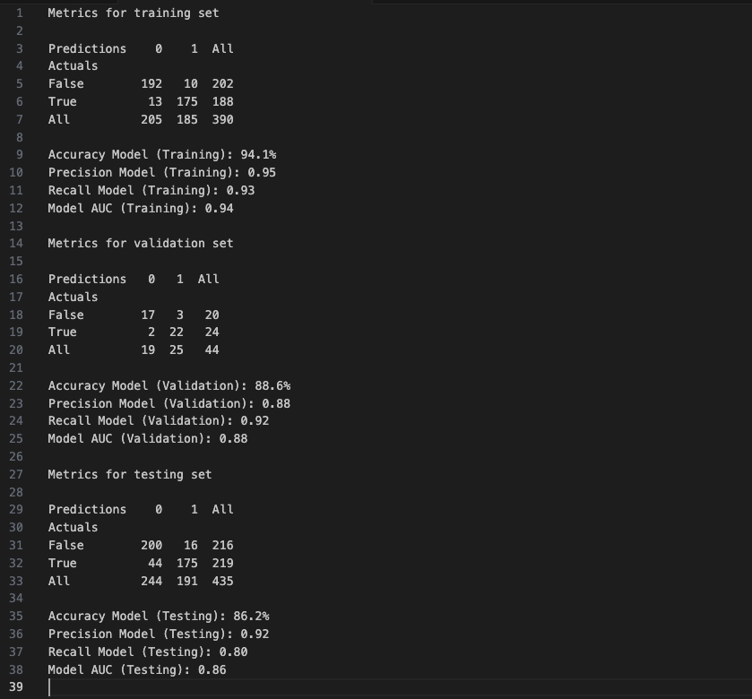

# congress_districts
PREDICTING 2024 CONGRESSIONAL DISTRICT OUTCOMES USING POLLING DATA AND DIMENSIONALITY REDUCTION ON AMERICAN COMMUNITY SURVEY DATA

Utilizing singular value decomposition (SVD) with an automated selection criterion, which captures 97.5% of the variation in the data, American Community Survey (ACS) 5-Year Estimates that were originally comprised of 7,371 separate features were reduced to a mere six components. On fitting a baseline model that so far lacks hyperparameter tuning and omits the relevant pre-election polling data, these six components yield a training set overall accuracy of 94.1%, a validation set overall accuracy of 88.6%, and a testing set overall accuracy of 86.2%. Given the shifting congressional district lines between the naively chosen training and validation set year (i.e., 2020) and testing set year (i.e., 2022), coupled with the fact that the latter was also a midterm election cycle where the composition of the vote typically differs from the general election cycle in both number and demographically, these early results display just how powerful a technique like SVD can be by itself for distilling from a large amount of data those salient features that are encoded within it.

Note: This is an ongoing, active project. Taking a cue from other popular polling aggregate outcome predictors, it is intended as a proof of concept to show the development and deployment of an XGBoost classification model using Amazon Code Editor (Visual Studio Code-OSS) and Amazon Web Services (AWS) S3 buckets, EC2 instances, and SageMaker Pipelines. Stay tuned.