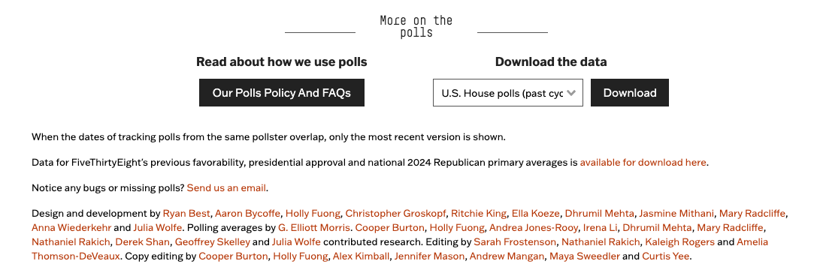

# data sources
American Community Survey (ACS) 1-Year Estimates datasets can be found at: https://data.census.gov/.

>Dataset Citation:

>U.S. Census Bureau. "ACS 1-Year Estimates Subject Tables," American Community Survey, 2023. [Online]. Available: https://data.census.gov/table/ACSST1Y2023.S0101?g=010XX00US$5000000&y=2023&d=ACS%201-Year%20Estimates%20Subject%20Tables.

American Community Survey (ACS) 5-Year Estimates datasets can be found at: https://www.nhgis.org/.

>Dataset Citation:

>S. Manson, J. Schroeder, D. Van Riper, K. Knowles, T. Kugler, F. Roberts, and S. Ruggles. "IPUMS National Historical Geographic Information System: Version 18.0," Minneapolis, MN: IPUMS Center for Data Integration, 2023. [Online]. Available: http://doi.org/10.18128/D050.V18.0.

U.S. House 1976-2022 outcomes can be found at: https://dataverse.harvard.edu/dataset.xhtml?persistentId=doi:10.7910/DVN/IG0UN2.

>Dataset Citation: 

>MIT Election Data and Science Lab. "U.S. House 1976–2022," Harvard Dataverse, V13, 2017. [Online]. Available: https://doi.org/10.7910/DVN/IG0UN2.

U.S. House polls for the current and past cycles can be found on the bottom of the page at: https://projects.fivethirtyeight.com/polls/.

